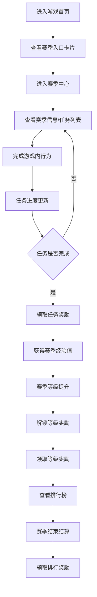

## 1. 产品概述

任务赛季中心是殡仪馆地下二层游戏的核心玩法模块，通过赛季制的任务系统提升玩家留存和活跃度。玩家在限定赛季周期内完成各类任务获取赛季经验值，提升赛季等级，解锁丰厚奖励，并在排行榜中与其他玩家竞争。

- **核心目标**：通过赛季制玩法提升玩家粘性，建立长期游戏目标
- **目标用户**：游戏核心玩家，追求成就、收藏和排行竞争的用户
- **核心价值**：周期性内容更新、差异化奖励体系、社区竞争氛围

## 2. 核心功能

### 2.1 用户角色

| 角色 | 注册方式 | 核心权限 |
|------|----------|----------|
| 普通玩家 | 游戏内自动生成匿名ID | 参与赛季、完成任务、领取奖励、查看排行榜 |
| 管理员 | 后台管理登录 | 赛季配置、奖励配置、排行榜管理 |

### 2.2 功能模块

1. **赛季中心主页**：赛季概览、当前赛季信息、赛季倒计时、快速入口
2. **赛季任务列表**：每日任务、每周任务、赛季挑战任务、任务进度展示
3. **进度追踪**：赛季等级进度、经验值获取记录、奖励解锁里程碑
4. **奖励系统**：奖励预览、奖励领取、已领取奖励记录
5. **排行榜**：赛季积分排行、排行奖励、结算时间展示
6. **首页联动**：首页赛季卡片、任务提醒、奖励红点提示

### 2.3 页面详情

| 页面名称 | 模块名称 | 功能描述 |
|-----------|-------------|---------------------|
| 赛季中心主页 | 赛季头部 | 展示赛季主题、赛季时间、倒计时、当前等级 |
| 赛季中心主页 | 进度总览 | 经验值进度条、下一等级奖励预览、累计积分 |
| 赛季中心主页 | 快捷入口 | 任务列表、排行榜、奖励预览入口卡片 |
| 任务列表页 | 任务分类Tab | 每日任务、每周任务、赛季挑战切换 |
| 任务列表页 | 任务卡片 | 任务描述、完成条件、奖励、进度条、领取按钮 |
| 进度追踪页 | 等级里程碑 | 赛季等级列表、各等级奖励、已解锁/未解锁状态 |
| 进度追踪页 | 经验记录 | 最近经验获取记录、来源、时间 |
| 奖励中心页 | 可领取奖励 | 未领取的等级奖励、任务奖励卡片 |
| 奖励中心页 | 奖励历史 | 已领取奖励记录、时间、类型 |
| 排行榜页 | 排行榜列表 | 玩家排名、头像、昵称、积分、与前一名差距 |
| 排行榜页 | 个人排名 | 自身排名位置高亮、积分展示 |
| 排行榜页 | 排行奖励 | 各档位奖励预览、结算倒计时 |
| 首页联动 | 赛季卡片 | 首页展示当前赛季简况、任务进度提醒 |
| 首页联动 | 红点系统 | 任务完成、奖励可领取的红点提示 |

## 3. 核心流程

### 3.1 玩家赛季参与流程

玩家进入首页 → 查看赛季入口卡片 → 进入赛季中心 → 查看当前赛季信息 → 浏览任务列表 → 完成游戏内行为触发任务进度 → 任务完成后领取奖励 → 获得赛季经验提升等级 → 解锁等级奖励 → 查看排行榜排名 → 赛季结束结算排行奖励

### 3.2 赛季配置与结算流程

管理员配置赛季 → 设置赛季时间 → 配置任务池 → 配置奖励池 → 配置排行榜奖励 → 赛季自动开启 → 玩家参与 → 赛季自动结束 → 排行榜结算 → 发放排行奖励 → 赛季归档

## 4. 用户界面设计

### 4.1 设计风格

延续游戏暗黑哥特风格，融入赛季仪式感设计：

- **主色调**：深邃暗紫 `#2d1b4e` 作为赛季主题色，搭配血红 `#dc2626` 作为强调色
- **辅助色**：金色 `#fbbf24` 用于奖励、琥珀色 `#f59e0b` 用于进度、暗灰 `#1f2937` 作为背景
- **按钮风格**：暗黑浮雕按钮，悬停时有微弱发光效果，点击有按压反馈
- **字体**：标题使用衬线字体增强仪式感，正文使用清晰易读的无衬线字体
- **布局风格**：卡片式布局，配合暗黑纹理背景，边框使用暗红色渐变
- **图标风格**：Lucide图标配合暗色主题，关键图标使用发光效果
- **动效**：
  - 进度条填充时的流光效果
  - 奖励领取时的粒子爆发动画
  - 等级提升时的全屏庆祝动画
  - 卡片悬停时的微上浮和阴影加深

### 4.2 页面设计概述

| 页面名称 | 模块名称 | UI元素 |
|-----------|-------------|-------------|
| 赛季中心主页 | 赛季头部 | 赛季主题艺术字、倒计时数字动画、等级徽章、经验进度条带流光 |
| 赛季中心主页 | 快捷入口 | 三张功能卡片（任务、进度、排行），带图标和角标红点 |
| 任务列表页 | 任务分类 | Tab切换带下划线动画，激活项发光 |
| 任务列表页 | 任务卡片 | 左侧任务图标、中间任务描述和进度条、右侧奖励图标和领取按钮 |
| 进度追踪页 | 等级里程碑 | 垂直时间轴布局，已解锁节点发光，未解锁节点灰暗 |
| 排行榜页 | 排行榜列表 | 前三名特殊头像框（金/银/铜），排名变化箭头动画 |
| 奖励中心页 | 奖励卡片 | 奖励图标发光、稀有度边框、领取按钮脉冲动画 |
| 首页联动 | 赛季卡片 | 右下角悬浮卡片，收缩/展开动画，红点闪烁 |

### 4.3 响应式设计

- **桌面端**：完整布局，侧边导航 + 主内容区，1200px以上最佳体验
- **平板端**：顶部导航 + 卡片网格，自适应两列布局
- **移动端**：底部Tab导航，单列瀑布流，触摸优化按钮尺寸（最小44px）
- **触摸优化**：所有可点击区域增加触摸反馈，滑动手势支持页面切换

### 4.4 视觉氛围

- **背景**：深紫色到黑色的径向渐变，叠加微妙的网格纹理和噪点
- **光效**：赛季主题色的环境光，从屏幕边缘向内渐变
- **粒子**：背景中缓慢漂浮的微光粒子，类似灵体飘动效果
- **边框**：暗红色渐变边框，角落有装饰性花纹
- **层级**：通过阴影、发光、模糊营造深度感，卡片有轻微3D倾斜效果
