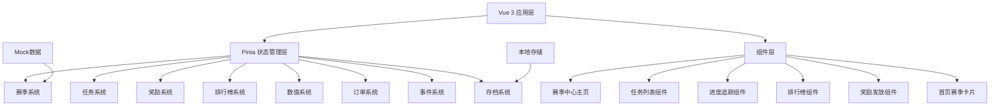
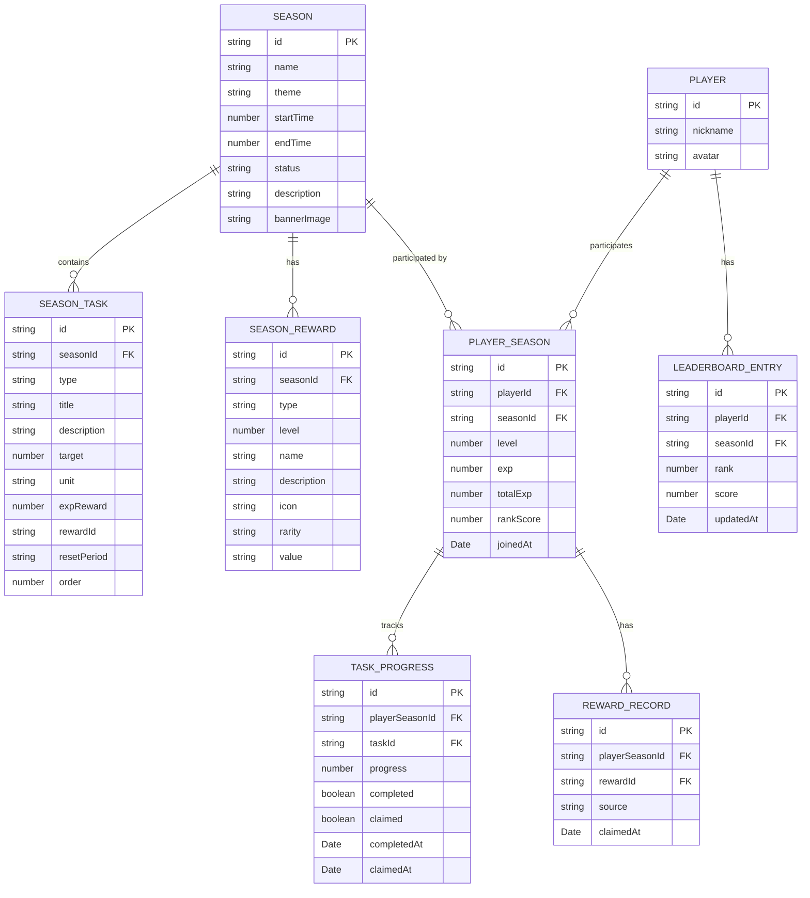

## 1. 架构设计



## 2. 技术描述

- **前端框架**: Vue 3 + TypeScript + Composition API
- **状态管理**: Pinia
- **构建工具**: Vite 5
- **样式方案**: Tailwind CSS 3 + CSS Variables
- **存储**: LocalStorage
- **图标**: Lucide Vue
- **数据**: Mock数据模拟赛季配置、任务池、排行榜数据

## 3. 目录结构

```
src/
├── components/season/          # 赛季中心组件目录
│   ├── SeasonCenter.vue        # 赛季中心主页
│   ├── SeasonHeader.vue        # 赛季头部信息
│   ├── TaskList.vue            # 任务列表
│   ├── TaskCard.vue            # 任务卡片
│   ├── ProgressTracker.vue     # 进度追踪
│   ├── LevelMilestone.vue      # 等级里程碑
│   ├── Leaderboard.vue         # 排行榜
│   ├── RewardCenter.vue        # 奖励中心
│   ├── RewardCard.vue          # 奖励卡片
│   └── HomeSeasonCard.vue      # 首页赛季卡片
├── stores/                     # Pinia stores
│   ├── seasonStore.ts          # 赛季状态管理
│   ├── gameStore.ts            # 游戏主状态
│   ├── orderStore.ts           # 订单状态
│   └── eventStore.ts           # 事件状态
├── game/data/                  # 静态数据
│   ├── seasons.ts              # 赛季配置数据
│   ├── seasonTasks.ts          # 赛季任务池
│   ├── seasonRewards.ts        # 赛季奖励配置
│   ├── events.ts               # 事件脚本数据
│   └── relics.ts               # 遗物属性数据
├── types/                      # 类型定义
│   └── season.ts               # 赛季相关类型
├── composables/                # 组合式函数
│   ├── useSeason.ts            # 赛季逻辑
│   ├── useSeasonTask.ts        # 任务追踪逻辑
│   └── useSeasonReward.ts      # 奖励发放逻辑
├── pages/                      # 页面
│   ├── SeasonPage.vue          # 赛季中心页面
│   ├── GamePage.vue            # 游戏页面
│   └── HomePage.vue            # 首页
└── router/                     # 路由
    └── index.ts                # 路由配置
```

## 4. 路由定义

| 路由 | 页面名称 | 功能描述 |
|-------|---------|----------|
| / | 游戏首页 | 游戏主界面，包含赛季入口卡片 |
| /season | 赛季中心 | 赛季中心主页，展示赛季概览和快捷入口 |
| /season/tasks | 任务列表 | 展示每日/每周/赛季任务 |
| /season/progress | 进度追踪 | 赛季等级进度和经验记录 |
| /season/rewards | 奖励中心 | 可领取奖励和奖励历史 |
| /season/leaderboard | 排行榜 | 赛季积分排行榜 |

## 5. 数据模型

### 5.1 数据模型ER图



### 5.2 类型定义

```typescript
// 赛季状态
type SeasonStatus = 'upcoming' | 'active' | 'ended' | 'settled'

// 赛季
interface Season {
  id: string
  name: string
  theme: string
  startTime: number
  endTime: number
  status: SeasonStatus
  description: string
  bannerImage: string
  maxLevel: number
  baseExpPerLevel: number
  expMultiplier: number
}

// 任务类型
type TaskType = 'daily' | 'weekly' | 'challenge'
type TaskResetPeriod = 'daily' | 'weekly' | 'never'

// 赛季任务
interface SeasonTask {
  id: string
  seasonId: string
  type: TaskType
  title: string
  description: string
  target: number
  unit: string
  expReward: number
  rewardId?: string
  resetPeriod: TaskResetPeriod
  order: number
  icon: string
  condition: {
    type: 'order_complete' | 'order_accept' | 'day_pass' | 'relic_purify' | 'money_earn' | 'reputation_gain'
    params?: Record<string, any>
  }
}

// 奖励稀有度
type RewardRarity = 'common' | 'uncommon' | 'rare' | 'epic' | 'legendary'
type RewardType = 'currency' | 'item' | 'title' | 'badge' | 'cosmetic'

// 赛季奖励
interface SeasonReward {
  id: string
  seasonId: string
  type: RewardType
  level: number
  name: string
  description: string
  icon: string
  rarity: RewardRarity
  value: string | number
  isFree: boolean
}

// 玩家赛季数据
interface PlayerSeason {
  id: string
  playerId: string
  seasonId: string
  level: number
  exp: number
  totalExp: number
  rankScore: number
  joinedAt: number
  lastResetDaily: number
  lastResetWeekly: number
}

// 任务进度
interface TaskProgress {
  id: string
  playerSeasonId: string
  taskId: string
  progress: number
  completed: boolean
  claimed: boolean
  completedAt?: number
  claimedAt?: number
}

// 奖励领取记录
interface RewardRecord {
  id: string
  playerSeasonId: string
  rewardId: string
  source: 'level' | 'task' | 'rank'
  claimedAt: number
}

// 排行榜条目
interface LeaderboardEntry {
  id: string
  playerId: string
  seasonId: string
  playerName: string
  playerAvatar: string
  rank: number
  score: number
  previousRank?: number
  updatedAt: number
}

// 经验获取记录
interface ExpRecord {
  id: string
  playerSeasonId: string
  amount: number
  source: string
  sourceId: string
  createdAt: number
}
```

## 6. 状态管理

### Season Store

- **state**:
  - `currentSeason`: 当前赛季信息
  - `playerSeason`: 玩家当前赛季数据
  - `tasks`: 赛季任务列表
  - `taskProgress`: 任务进度映射
  - `rewards`: 赛季奖励列表
  - `claimedRewards`: 已领取奖励ID集合
  - `leaderboard`: 排行榜数据
  - `expRecords`: 经验获取记录
  - `unclaimedCount`: 未领取奖励数量

- **getters**:
  - `isSeasonActive`: 赛季是否进行中
  - `timeRemaining`: 赛季剩余时间
  - `currentLevelExp`: 当前等级所需经验
  - `nextLevelExp`: 下一等级所需经验
  - `expProgress`: 经验进度百分比
  - `dailyTasks`: 每日任务列表
  - `weeklyTasks`: 每周任务列表
  - `challengeTasks`: 赛季挑战任务列表
  - `completedTasksCount`: 已完成任务数量
  - `playerRank`: 玩家当前排名

- **actions**:
  - `initSeason()`: 初始化赛季数据
  - `loadCurrentSeason()`: 加载当前赛季
  - `loadPlayerSeason()`: 加载玩家赛季数据
  - `loadTasks()`: 加载赛季任务
  - `loadRewards()`: 加载赛季奖励
  - `loadLeaderboard()`: 加载排行榜
  - `updateTaskProgress(taskType, params)`: 更新任务进度
  - `claimTaskReward(taskId)`: 领取任务奖励
  - `claimLevelReward(level)`: 领取等级奖励
  - `addExp(amount, source, sourceId)`: 增加赛季经验
  - `checkLevelUp()`: 检查等级提升
  - `resetDailyTasks()`: 重置每日任务
  - `resetWeeklyTasks()`: 重置每周任务
  - `settleSeason()`: 结算赛季
  - `hasUnclaimedRewards()`: 检查是否有未领取奖励

## 7. 核心模块设计

### 7.1 赛季配置模块

- 赛季数据配置：赛季主题、时间、等级曲线
- 任务池配置：每日任务、每周任务、赛季挑战
- 奖励池配置：等级奖励、任务奖励、排行奖励
- 配置热更新：支持赛季期间动态调整配置

### 7.2 任务追踪模块

- 任务进度监听：监听游戏内事件触发任务进度更新
- 任务重置机制：每日/每周自动重置任务
- 任务完成判定：进度达到目标值时标记完成
- 任务类型支持：
  - 完成订单数量
  - 接取订单数量
  - 存活天数
  - 净化遗物数量
  - 累计获取金钱
  - 累计获取声望

### 7.3 经验与等级模块

- 经验获取：完成任务、达成成就获取经验
- 等级曲线：`所需经验 = baseExp * (level ^ expMultiplier)`
- 等级提升：经验达到阈值自动升级
- 经验记录：记录所有经验获取来源和时间

### 7.4 奖励发放模块

- 等级奖励：达到指定等级可领取
- 任务奖励：完成任务可领取
- 排行奖励：赛季结束根据排名发放
- 奖励类型：货币、道具、称号、徽章、外观
- 领取记录：记录所有奖励领取历史

### 7.5 排行榜模块

- 积分计算：根据赛季等级、任务完成度、游戏表现计算
- 排名更新：定时更新排行榜
- 排名变化：显示与上一次排名的变化
- 排行榜奖励：根据排名档位发放奖励

### 7.6 首页联动模块

- 赛季入口卡片：显示赛季基本信息和进度
- 任务提醒：显示进行中和已完成的任务
- 红点提示：任务完成、奖励可领取时显示红点
- 快速入口：点击直接进入对应模块

## 8. 核心算法

### 8.1 等级经验计算

```typescript
function getExpForLevel(level: number, baseExp: number, multiplier: number): number {
  return Math.floor(baseExp * Math.pow(level, multiplier))
}

function getLevelFromExp(totalExp: number, baseExp: number, multiplier: number): number {
  let level = 1
  while (getExpForLevel(level + 1, baseExp, multiplier) <= totalExp) {
    level++
  }
  return level
}
```

### 8.2 排行榜积分计算

```typescript
function calculateRankScore(playerSeason: PlayerSeason, taskProgresses: TaskProgress[]): number {
  const levelScore = playerSeason.level * 100
  const expScore = playerSeason.totalExp * 0.1
  
  const completedTasks = taskProgresses.filter(t => t.completed).length
  const taskScore = completedTasks * 50
  
  return levelScore + expScore + taskScore
}
```

### 8.3 任务进度更新

```typescript
function updateTaskProgress(
  taskType: string,
  params: Record<string, any>,
  tasks: SeasonTask[],
  progresses: TaskProgress[]
): TaskProgress[] {
  return progresses.map(progress => {
    const task = tasks.find(t => t.id === progress.taskId)
    if (!task || progress.completed) return progress
    
    if (task.condition.type === taskType) {
      const newProgress = Math.min(progress.progress + 1, task.target)
      return {
        ...progress,
        progress: newProgress,
        completed: newProgress >= task.target,
        completedAt: newProgress >= task.target ? Date.now() : undefined
      }
    }
    return progress
  })
}
```

### 8.4 赛季倒计时

```typescript
function getCountdown(endTime: number): { days: number; hours: number; minutes: number; seconds: number } {
  const diff = Math.max(0, endTime - Date.now())
  return {
    days: Math.floor(diff / (1000 * 60 * 60 * 24)),
    hours: Math.floor((diff % (1000 * 60 * 60 * 24)) / (1000 * 60 * 60)),
    minutes: Math.floor((diff % (1000 * 60 * 60)) / (1000 * 60)),
    seconds: Math.floor((diff % (1000 * 60)) / 1000)
  }
}
```

## 9. 存档系统集成

### 9.1 赛季数据存档

```typescript
interface SeasonSaveData {
  version: string
  timestamp: number
  currentSeasonId: string
  playerSeasons: PlayerSeason[]
  taskProgresses: TaskProgress[]
  rewardRecords: RewardRecord[]
  expRecords: ExpRecord[]
}
```

### 9.2 存档触发时机

- 任务进度更新时
- 领取奖励时
- 等级提升时
- 游戏结束时
- 手动存档时
