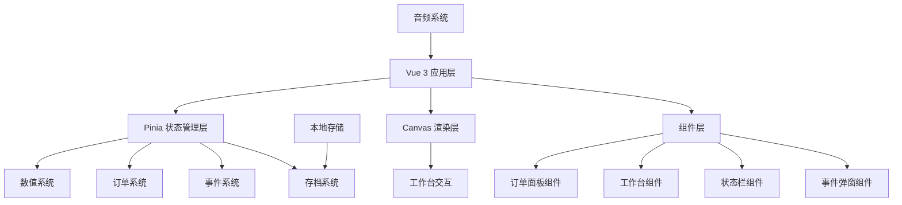

## 1. 架构设计



## 2. 技术描述

- **前端框架**: Vue 3 + TypeScript + Composition API
- **状态管理**: Pinia
- **构建工具**: Vite 5
- **渲染技术**: Canvas 2D API
- **样式方案**: Tailwind CSS 3 + CSS Variables
- **音频**: Web Audio API + HTML5 Audio
- **存储**: LocalStorage
- **图标**: Lucide Vue

## 3. 目录结构

```
src/
├── components/          # 组件目录
│   ├── OrderPanel.vue   # 订单面板
│   ├── Workbench.vue    # 工作台（Canvas）
│   ├── StatusBar.vue    # 状态栏
│   ├── EventModal.vue   # 事件弹窗
│   └── ToolBar.vue      # 工具栏
├── stores/              # Pinia stores
│   ├── gameStore.ts     # 游戏主状态
│   ├── orderStore.ts    # 订单状态
│   └── audioStore.ts    # 音频状态
├── composables/         # 组合式函数
│   ├── useCanvas.ts     # Canvas 交互逻辑
│   ├── usePurify.ts     # 净化逻辑
│   └── useSave.ts       # 存档逻辑
├── data/                # 静态数据
│   ├── orders.ts        # 遗物订单数据
│   ├── events.ts        # 事件脚本数据
│   └── relics.ts        # 遗物属性数据
├── utils/               # 工具函数
│   ├── audio.ts         # 音频工具
│   ├── storage.ts       # 存储工具
│   └── random.ts        # 随机工具
├── types/               # 类型定义
│   └── index.ts         # 全局类型
├── App.vue              # 根组件
├── main.ts              # 入口文件
└── style.css            # 全局样式
```

## 4. 数据模型

### 4.1 遗物 (Relic)
```typescript
interface Relic {
  id: string
  name: string
  description: string
  image: string
  rarity: 'common' | 'uncommon' | 'rare' | 'dangerous'
  corruption: number      // 污染度 0-100
  resentment: number      // 怨念值 0-100
  purificationMethod: 'wipe' | 'talisman' | 'soak' | 'burn' | 'combine'
  reward: number
  story: string
}
```

### 4.2 订单 (Order)
```typescript
interface Order {
  id: string
  relicId: string
  clientName: string
  deadline: number        // 剩余天数
  reward: number
  status: 'available' | 'accepted' | 'completed' | 'failed'
  acceptedDay: number
}
```

### 4.3 玩家状态 (PlayerState)
```typescript
interface PlayerState {
  day: number
  time: 'day' | 'night'
  sanity: number          // 精神值 0-100
  reputation: number      // 声望 0-1000
  money: number
  acceptedOrders: string[]
  completedOrders: string[]
  inventory: string[]     // 道具库存
}
```

### 4.4 游戏事件 (GameEvent)
```typescript
interface GameEvent {
  id: string
  type: 'story' | 'random' | 'danger'
  title: string
  content: string
  choices: {
    text: string
    effect: {
      sanity?: number
      reputation?: number
      money?: number
      triggerEvent?: string
    }
  }[]
}
```

### 4.5 存档 (SaveData)
```typescript
interface SaveData {
  version: string
  timestamp: number
  playerState: PlayerState
  orders: Order[]
  currentRelic: string | null
  progress: {
    [relicId: string]: number  // 净化进度 0-100
  }
}
```

## 5. 状态管理

### Game Store
- `state`: 玩家状态、当前选中遗物、游戏设置
- `actions`: 
  - `nextDay()`: 进入下一天
  - `toggleTime()`: 切换昼夜
  - `updateSanity(amount)`: 更新精神值
  - `updateMoney(amount)`: 更新金钱
  - `updateReputation(amount)`: 更新声望

### Order Store
- `state`: 可用订单列表、已接订单
- `actions`:
  - `generateDailyOrders()`: 生成每日订单
  - `acceptOrder(orderId)`: 接取订单
  - `completeOrder(orderId)`: 完成订单
  - `failOrder(orderId)`: 订单失败

### Audio Store
- `state`: 音量设置、当前播放列表
- `actions`:
  - `playAmbient()`: 播放环境音
  - `playEffect(effectName)`: 播放音效
  - `setVolume(type, value)`: 设置音量

## 6. 核心模块设计

### 6.1 Canvas 工作台
- 60fps 渲染循环
- 遗物渲染（根据污染度显示不同视觉效果）
- 工具交互（拖拽、点击、绘制）
- 净化进度可视化
- 粒子效果（怨念消散、符咒发光）

### 6.2 净化系统
- **擦拭**: 计算鼠标/手指划过的路径覆盖度
- **画符**: 匹配轨迹相似度（DTW 算法简化版）
- **浸泡**: 选择正确的配方组合
- **焚烧**: QTE 时间窗口操作

### 6.3 事件系统
- 触发条件：特定日期、特定遗物、精神值过低
- 分支选择影响数值和后续剧情
- 随机事件池按权重抽取

### 6.4 存档系统
- 自动存档：每日结束、完成订单时
- 手动存档：随时保存
- 存档槽位：3个手动槽 + 1个自动槽
- 存档校验：版本号 + 时间戳

## 7. 核心算法

### 7.1 订单生成算法
```
权重 = 基础权重 + (声望 / 100) * 稀有度加成
稀有订单概率 = min(0.1 + 声望 / 2000, 0.4)
每日订单数量 = 2 + floor(声望 / 300)
```

### 7.2 净化判定
```
最终得分 = 操作精度 * 0.6 + 时间奖励 * 0.2 + 工具加成 * 0.2
成功阈值 = 遗物难度 * (1 - 精神值 / 200)
若得分 >= 成功阈值：净化成功
否则：精神值 -= 遗物难度 * 2
```

### 7.3 精神值衰减
```
每夜基础消耗 = 5
每处理一个遗物额外消耗 = 遗物污染度 / 10
白天自然恢复 = 10 + floor(声望 / 200)
```
